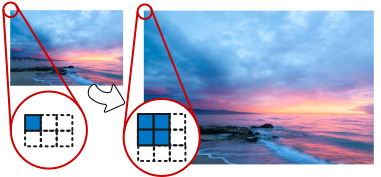
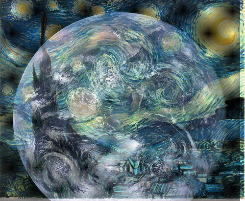

## Adding Commands to ImageShop
- When you download the starter template for ImageShop, it already implements the viewing area along with the **Load** and **Flip Vertical** buttons.

:::incremental
- To add a new command to ImageShop, you need to add code to accomplish the following steps:
  - Add a new callback function that handles the click action for the button.
  - Add the new button to the window.
  - Implement the image transformation function.
- These code fragments appear in different parts of the program, but you can use **Flip Vertical** as a guide illustrating what you need to do.
:::

## Problem 1: Correct the Red-Eye Effect
::::::{.cols style='align-items: center'}
::::col
- When you take a picture of a face, the light from the flash often reflects off the blood vessels in the retina, making the pupils of the eye appear bright red. This phenomenon is called the _red-eye effect_ and looks like the image to the right.
- This effect is generally unwanted, and thus a common operation is to try to remove it.

::::

::::col

:::r-stack

{width=100%}

{.fragment width=100%}

:::

::::
::::::

## The Red-Eye Operation
- Your job in this problem is to implement a **Red Eye** button that:
  - Goes through each pixel checking to see if it is overly red
    - "Overly red" here is if the red component is at least twice the max of the blue and green components
  - If a pixel is overly red, replace it with a pixel where the red component has been lowered to equal the max of the blue and green components


## Red-Eye Corrected
```{.mypython style='max-height:800px; font-size:.8em;'}
def correct_red_eye(image):
    """Creates a new GImage that reduces the red-eye effect."""
    array = image.get_pixel_array()
    height = len(array)
    width = len(array[0])
    for r in range(height):
        for c in range(width):
            pixel = array[r][c]
            rr = GImage.get_red(pixel)
            gg = GImage.get_green(pixel)
            bb = GImage.get_blue(pixel)
            if rr >= 2 * max(gg, bb):
                rr = max(gg, bb)
            array[r][c] = GImage.create_rgb_pixel(rr, gg, bb)
    return GImage(array)
```


## Problem 2: Doubling an Image
- Another common image transformation is that of scaling, where the image is made either larger or smaller
- When doing so, there is always a mismatch in the number of pixels in the larger vs the smaller image that needs to be resolved
- Enlarging an image by a factor of 2 means copying the same pixel from the smaller image 4 times into the larger images
- Your task here is to add a button called **Double** which will double the current size of an image.

## Doubling: A Visual



## Doubling Steps
- Accomplishing this task thus means:
  - Creating a new 2D array of the desired dimensions
  - Looping over the original image pixels
  - Copying each pixel value to its four new locations in the new array
    - How do you determine the rows and columns of these new locations?
    - Draw yourself a picture!
    - Work through a few examples (Where does the (0,0) pixel need to go? What about the (1,0) pixel?) to work out the pattern.


## Doubling Solution
```{.mypython style='max-height:800px; font-size:.8em;'}
def double_image(image):
    array = image.get_pixel_array()
    height = len(array)
    width = len(array[0])
    new_array = [ 
          [0 for c in range(width * 2)] for r in range(height * 2)
      ]
    for r in range(height):
        for c in range(width):
            pixel = array[r][c]
            new_array[2*r][2*c] = pixel
            new_array[2*r][2*c+1] = pixel
            new_array[2*r+1][2*c+1] = pixel
            new_array[2*r+1][2*c] = pixel
    return GImage(new_array)
```


## Problem 3: Cumulative Histograms
- Write a function
  ```mypython
  def create_cumulative_histogram(hist):
  ```
  that takes a histogram array `hist` and returns a new array in which each value in an index represents the sum of all values in `hist` up to and including that index.

:::incremental
- This new array is called the _cumulative histogram_.
- In solving this problem, you should refer back to the histogram problem you wrote for Problem Set 5 for the definition of the histogram array. In particular, you can use the function `create_histogram_array` to create a histogram array to feed into `create_cumulative_histogram`.
:::

## Example: Cumulative Histogram
- As an example, suppose that you have executed the following lines:
  ```mypython
  SCORES = [ 8, 7, 8, 6, 8, 10, 4, 9, 6, 9, 7, 8 ]
  histogram_array = create_histogram_array(11, SCORES)
  ```
  using `create_histogram_array` as you implemented it for PS5 to create the following histogram array:
  \begin{tikzpicture}%%width=70%
  \foreach[count=\i from 0] \v in {0,0,0,0,1,0,2,2,4,2,1} {
    \node[MBlue, draw, minimum size=1cm, font=\Large, thick, label={[MOrange]below:\i}] at (\i,0) {\v};
    }
  \end{tikzpicture}
- The corresponding cumulative histogram should look then like:
  \begin{tikzpicture}%%width=70%
  \foreach[count=\i from 0] \v in {0,0,0,0,1,1,3,5,9,11,12} {
    \node[MBlue, draw, minimum size=1cm, font=\Large, thick, label={[MOrange]below:\i}] at (\i,0) {\v};
    }
  \end{tikzpicture}
 
## Solution 1: Keeping a Running Total
```{.mypython style='font-size:.8em; max-height: 800px;'}
def create_cumulative_histogram(hist):
    """
    Returns the cumulative histogram corresponding to the histogram
    array hist.  Index k in the cumulative histogram indicates the
    number of values less than or equal to k in the original 
    sample.
    """
    chist = [ 0 for i in range(len(hist)) ]
    total = 0
    for i in range(len(hist)):
        total += hist[i]
        chist[i] = total
    return chist
```

## Solution 2: A Pythonic One-Liner
```{.mypython style='font-size:.72em; max-height:850px;'}
# Implementation notes: create_cumulative_histogram
# -------------------------------------------------
# This implementation of create_cumulative_histogram uses the Python
# features of list comprehension, slicing, and the library sum function
# to reduce the code to a single line.  Each element in the comprehension
# is the sum of all the elements at or below that index.  This version
# performs many more additions than the expanded version because the
# sum is recomputed each time.

def create_cumulative_histogram(hist):
    """
    Returns the cumulative histogram corresponding to the histogram
    array hist.  Index k in the cumulative histogram indicates the
    number of values less than or equal to k in the original sample.
    """
    return [ sum(hist[:i + 1]) for i in range(len(hist)) ]
```

## Optional Problem: Overlay
- Implement an **Overlay** button for ImageShop that creates a new picture by interleaving the pixels from the current image and an image loaded from a file.
- In the new image, pixels come from the current image if the sum of the row and column is even, and from the loaded image if that sum is odd.
- If you use overlay to combine Starry Night with the image of Earth, you get the following image:
  
- Note that these images are not the same size, so you need to account for that!


## Overlay Solution:
```{.mypython style='font-size:.8em; max-height:850px;'}
def overlay(image):
    # Get the second image
    filename = choose_input_file()
    if filename != "":
        image2 = GImage(filename)

    # Process
    array1 = image.get_pixel_array()
    array2 = image2.get_pixel_array()
    min_height = min(len(array1), len(array2))
    min_width = min(len(array1[0]), len(array2[0]))
    for r in range(min_height):
        for c in range(min_width):
            if (r + c) % 2 == 1:
                array1[r][c] = array2[r][c]
    return GImage(array1)
```
